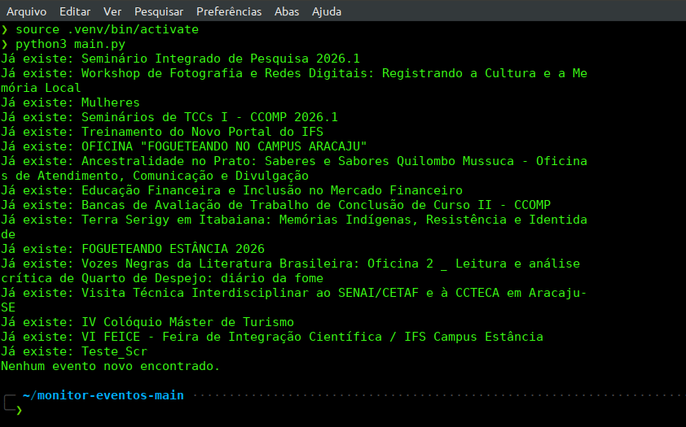
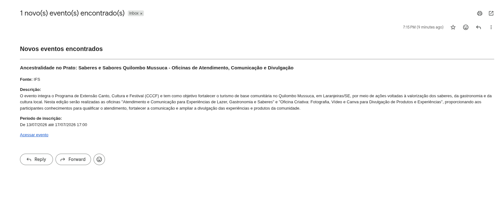

# Monitor Eventos

Monitor Eventos é uma ferramenta em Python que acompanha portais de eventos de instituições de ensino, identifica novos eventos publicados e envia notificações automaticamente.

O objetivo do projeto é evitar a necessidade de acessar manualmente diferentes portais todos os dias em busca de oportunidades como palestras, minicursos, oficinas, semanas acadêmicas, visitas técnicas e outros eventos.

## Funcionalidades

* Monitoramento automático de portais de eventos.
* Detecção de novos eventos.
* Persistência dos eventos em banco SQLite.
* Notificações por e-mail.
* Arquitetura preparada para adicionar novas fontes de eventos.

## Exemplo

Imagem do ```main.py``` rodando no terminal



Ao detectar um novo evento no portal do IFS, o Monitor Eventos envia automaticamente uma notificação por e-mail contendo:

- título;
- descrição;
- período de inscrição;
- link direto para o evento.



## Fontes suportadas

| Instituição                           | Status               |
| ------------------------------------- | -------------------- |
| Instituto Federal de Sergipe (IFS)    | ✅ Em desenvolvimento |
| Universidade Federal de Sergipe (UFS) | 🚧 Planejado         |

## Estrutura do projeto

```text
monitor-eventos/
├── core/              # Banco de dados e modelos
├── data/              # Banco SQLite
├── notifications/     # Serviços de notificação
├── sources/           # Scrapers das instituições
├── main.py
└── requirements.txt
```

## Tecnologias

* Python
* Requests
* BeautifulSoup4
* SQLModel
* SQLite

## Roadmap

* [x] Estrutura inicial do projeto
* [x] Primeiro scraper do IFS
* [x] Persistência em SQLite
* [x] Detecção de novos eventos
* [x] Notificações por e-mail
* [ ] Suporte ao portal da UFS

## Motivação

Este projeto nasceu da necessidade de acompanhar oportunidades acadêmicas em diferentes instituições sem precisar consultar cada portal manualmente todos os dias.

Além de resolver esse problema, o projeto serve como um estudo sobre scraping, persistência de dados, automação e arquitetura de software em Python.
